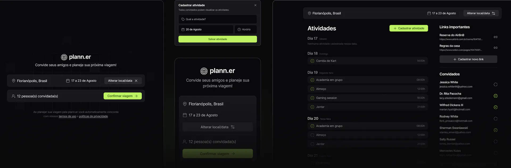

# NLW Rocketseat: Planejador de viagens 

  

Planejador de viagens para a trilha HTML+CSS+JavaScript do evento NLW da Rocketseat.  

     
    <a href="https://maya-franca.github.io/nlw-planejador-de-viagens/">➡️ Clique aqui para visualizar</a>

## Adição de novas funcionalidades: 
- Adição de sorting por data para as atividades no JavaScript, para que fiquem organizadas da mais próxima até a mais distante, sempre que a lista for atualizada; 
- Botão de exclusão de uma atividade com CSS e JavaScript; 
- Animação sobre hovers no CSS; 
- Adição de favicon no HTML; 
- Estilização do display do local com o país no CSS; 
